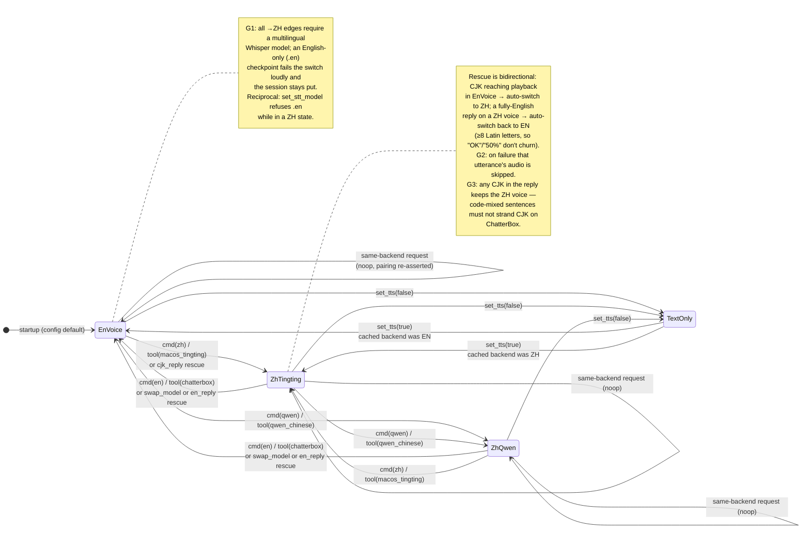

# Language-Switch State Machine

How LocalTalk keeps three pieces of state — **TTS voice** (`config.tts_backend`),
**STT input language** (`config.whisper.language`), and **reply language**
(`config.response_language` + system-prompt directive) — moving in lockstep
when the session language changes.

Sources: `src/localtalk/core/session_tools.py` (`set_tts_backend`, `set_tts_model`,
`set_session_language`, `ensure_voice_for_text`), `src/localtalk/core/assistant.py`
(`_handle_direct_tts_backend_command`, `_speak_sentence`, `_announce_spoken`),
`src/localtalk/models/config.py:239-247`.

## States

The machine's invariant: the pairing triple `(voice, whisper, reply)` is always
internally consistent. A state is fully described by its triple.

| State | `tts_backend` | `whisper.language` | `response_language` / directive |
|---|---|---|---|
| `EnVoice` (initial) | `chatterbox` | `en` | English + "respond only in English…" directive |
| `ZhTingting` | `apple_speech` (Tingting) | `zh` | Simplified Chinese + 中文 directive |
| `ZhQwen` | `qwen_chinese` | `zh` | Simplified Chinese + 中文 directive |
| `TextOnly` | `none` | *retained* | *retained* |

Notes:

- `TextOnly` is orthogonal to language pairing — `set_tts(False)` never touches
  `whisper.language` or the directive; the pre-disable backend is cached and
  restored by `set_tts(True)`.
- `macos_say` exists in `config.py:239` but is **not reachable** through the
  switch machinery (`set_tts_backend` maps only `macos_tingting` → `apple_speech`,
  `qwen_chinese`, else `chatterbox`); startup-config only.

## Events (transition triggers)

| Event | Surface | Gate |
|---|---|---|
| `cmd(zh)` — "说中文", "switch to Chinese" | `_handle_direct_tts_backend_command` (pre-LLM intercept, text **and** voice turns, `assistant.py:515/685`) | Conservative grammar: must open with an imperative; questions/statements about Chinese fall through to the LLM |
| `cmd(en)` — "switch back to English" | same | same |
| `cmd(qwen)` | same | same |
| `tool(backend)` — LLM calls `set_tts_backend` | session-control registry (`assistant.py:334`) | model judgment |
| `cjk_reply` — reply text contains CJK while in `EnVoice` | `ensure_voice_for_text` inside `_speak_sentence` and `_announce_spoken` | automatic (rescue) |
| `en_reply` — fully-English reply (no CJK, ≥8 Latin letters) while in a ZH voice | `ensure_voice_for_text` (both speech paths) | automatic (reverse rescue) |
| `swap_model` — `set_tts_model` (ChatterBox ckpt) | LLM tool | forces `EnVoice` pairing |
| `tts_off` / `tts_on` | `set_tts` tool | — |

## Guards & failure semantics

- **G1 (en-only Whisper):** if `whisper.model_size` ends in `.en`, every →ZH
  transition is rejected *before any state change*, with an error naming the
  multilingual twin (e.g. `small`). Reciprocal: `set_stt_model` refuses `.en`
  checkpoints while the session is in ZH.
- **G2 (rescue failure):** if a rescue switch fails, synthesis for
  that utterance is skipped (text remains on console); session state is
  unchanged.
- **G3 (code-mixing stays ZH):** a reply containing **any** CJK keeps the
  Chinese voice — switching mid-sentence would strand the CJK span on
  ChatterBox. Fully-English sentences are rescued back to `EnVoice`;
  short Latin blips ("OK", "50%") are exempt because Chinese voices say
  them fine. The ZH-session directive also instructs the LLM to call
  `set_tts_backend` itself before switching languages (mirror of the EN
  directive), so the rescue is a backstop, not the primary path.
- **Load failure on real switches:** backend assignment is rolled back; the
  previous state is preserved (`set_tts_backend`, and `set_tts(True)`).
- **Fast-path self-loop:** a switch request for the *current* backend skips the
  reload but still re-asserts the full pairing (repairs drift).

## Transition action (real switches)

Atomic-ish, in order: validate G1 → load new TTS service (rollback on failure)
→ swap instance, clear the TTS cache → set `whisper.language` → rebuild
`system_prompt` from `_base_system_prompt` + new directive (never stacks) →
refresh Apple Foundation Models session (apple LLM provider only) → for direct
commands, speak the confirmation **in the new voice** (audible demo).

Special case: Cantonese requests are deflected with a spoken apology (language-
appropriate), which itself passes through the CJK rescue on `EnVoice`.

## Diagram

Rendered: [`language_switch_state_machine.svg`](./language_switch_state_machine.svg)
(regenerate: `mmdc -i language_switch_state_machine.md -o ...` — source block below)

## Test coverage map

| Transition | Test |
|---|---|
| `EnVoice → ZhTingting` (tool) | `test_set_tts_backend_loads_macos_tingting` |
| `EnVoice → ZhQwen` (tool) | `test_set_tts_backend_loads_qwen_chinese` |
| →ZH blocked by G1 | `test_set_tts_backend_rejects_en_only_whisper_for_chinese` |
| G1 reciprocal (STT side) | `test_set_stt_model_rejects_en_only_during_chinese_session` |
| `cjk_reply` rescue + G2 skip | `TestEnsureVoiceForText`, `test_announce_spoken_rescues_chinese_text` |
| `en_reply` reverse rescue + blip/code-mix exemptions | `test_switches_to_chatterbox_for_english_on_chinese_voice`, `test_noop_for_blips_and_code_mixed_on_chinese_voice`, `test_speak_sentence_switches_then_speaks_english` |
| Directive switch guidance (both directions) | `test_english_directive_requires_tts_switch_for_other_languages`, `test_chinese_directive_requires_switch_back_for_english` |
| `swap_model` forces EN | `test_set_tts_model_resets_language_pairing` |
| Fast-path self-loops | `test_set_tts_model_noop_also_resets_language_pairing` |
| Full round trip en→zh→en→zh | `test_backend_switch_round_trip_repairs_language_pairing` |
| Command grammar (no hijack / hijack properly) | `TestDirectTtsBackendCommand` param cases |
| Direct cmd ↔ LLM tool parity | evals `switch-to-chinese-voice`, `switch-to-fast-english` |
